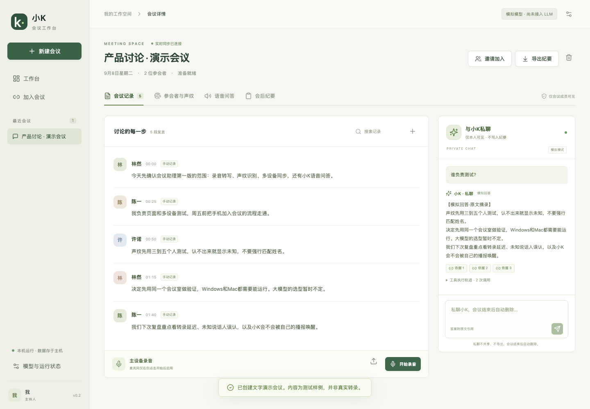

# 小K · AI 会议工作台

面向个人开发与 AI / Agent 求职展示的会议助理。主电脑运行服务和录音，手机及其他电脑通过浏览器加入。保留声纹识别、语音“小K”和多设备同步，文本大模型后续可选择本地模型或 API。



## 当前实现

- React / TypeScript 浏览器界面，FastAPI 服务，SQLite 持久化。
- 创建会议、邀请加入、主持人与参会者权限；支持主持人直接添加无设备的现场参会者，令牌只以哈希形式存入数据库。
- 浏览器麦克风采集、音频文件上传、faster-whisper CPU 转录、人工修正。
- 中文 WeSpeaker ONNX 声纹登记与短窗口匹配；相似度阈值及候选分差拒识；授权撤回、删除。
- sherpa-onnx 固定唤醒词“小K小K”，问题收音、ASR、受限会议 Agent 和浏览器中文语音播报。
- Agent 的真实工具执行循环：`search_meeting`、`get_utterances`、`list_confirmed_actions`；限制调用次数、参数、时间和上下文大小，校验已读取的发言引用。
- WebSocket 多端同步、刷新/重连完整快照、稳定发言去重、持久事件顺序号。
- 文字私聊按成员隔离，不广播、不导出，结束会议时自动删除；语音问答共享并进入纪要，支持主持人复核采纳、Markdown 导出。
- 旧 `.env` 不会自动读取，默认模型为明确标识的模拟模式，不产生真实大模型调用。

**已经验证的是本机软件链路，不是产品精度承诺。** Windows 真机、朋友声纹与真实会议尚待测试；尚未接入真实文本大模型。详见 [验收记录](docs/verification-v2.md)。

## 运行环境

Python 3.12、Node.js 22 或以上。macOS 与 Windows 共用应用代码；Windows 首先以 x64 为测试目标。录音建议使用 Chrome / Edge。

可用当前电脑开始；无需 Docker、Redis、云服务器或 GPU。模型文件位于 `models/`，会议数据位于 `data/v2/`，均不提交 Git。

### 当前这台 Mac

依赖与语音模型已经在当前工作目录中安装，可直接运行：

```bash
bash scripts/start-macos.sh
```

访问 **http://localhost:8765**。端口已被当前开发服务占用时，直接打开页面，或启动另一个端口：

```bash
bash scripts/start-macos.sh --port 8766
```

### 在另一台电脑安装

先克隆项目并进入目录：

```bash
git clone https://github.com/ma-ruofan/ai-meeting.git
cd ai-meeting
```

随后安装依赖和语音模型；不复制其他电脑的 `.venv`、`node_modules` 或个人会议数据。

macOS：

```bash
python3.12 -m venv .venv
.venv/bin/python -m pip install -e 'backend[voice,dev]'
npm ci --prefix frontend
npm run build --prefix frontend
.venv/bin/python scripts/setup_models.py
bash scripts/start-macos.sh
```

Windows PowerShell：

```powershell
py -3.12 -m venv .venv
.\.venv\Scripts\python.exe -m pip install -e "backend[voice,dev]"
npm ci --prefix frontend
npm run build --prefix frontend
.\.venv\Scripts\python.exe scripts\setup_models.py
.\.venv\Scripts\python.exe scripts\start.py
```

也提供 `scripts/start-windows.ps1` 启动入口；直接运行 Python 可避免系统对 PowerShell 脚本执行策略的影响。

语音下载包括 faster-whisper base、中文声纹 ONNX 和小型中英唤醒模型，**不下载文本大语言模型**。下载地址与本地文件哈希记录在 `models/downloads.json`。模型首次下载需联网，之后音频模型从本地加载。代码与权重许可证需分别查看对应上游发布页。

### 使用锁文件复现

`backend/uv.lock` 与 `frontend/package-lock.json` 保存依赖解析结果。安装 uv 后：

```bash
uv sync --project backend --extra voice --extra dev --frozen
uv run --project backend --extra voice --extra dev --frozen python scripts/setup_models.py
uv run --project backend --extra voice --extra dev --frozen python scripts/start.py
```

## 和朋友一起使用

1. 主电脑打开 `localhost:8765`，创建会议；也可以先打开文字演示会议。
2. 主电脑与朋友连接同一 Wi-Fi。朋友访问 `http://主电脑局域网IP:8765`，输入8位会议码和昵称并确认告知。
3. 有设备的人使用自己的加入身份，在“参会者与声纹”登记本人音频。无设备的人由主持人点击“添加现场参会者”，填写姓名并确认本人同意会议记录；随后点击该成员的“登记声纹”，让本人在主电脑前朗读，或上传1～3段本人的音频，并单独确认声纹授权。建议另留测试录音。
4. 主持人在主电脑点击“开始录音”。同一场会议只允许一台主录音设备。
5. 说“小K小K”后提出问题，静音约一秒结束收音；按钮“语音提问”是备用入口。
6. 语音小K的问题和答案进入“语音问答”及“会后纪要”的共享附录，自动保留并导出；复核后才能采纳为正式决定或待办。右侧聊天框为个人私聊，仅该参会身份可见。
7. 停止录音、等待处理完成后生成纪要，最后导出或结束会议。

朋友设备上的普通局域网 HTTP 页面用于查看和上传文件；网页麦克风需要 localhost 或受信任 HTTPS。无设备成员无需创建浏览器身份；主持人可以代其登记、撤回和删除声纹。每场最多12位参会者（包括主持人、设备加入和现场添加的成员）。局域网不可达时检查防火墙、访客 Wi-Fi 隔离和主机 IP。

## 私聊和共享语音问答

| 项目 | 右侧文字私聊 | 语音唤醒 / 语音提问 |
|---|---|---|
| 可见范围 | 仅当前参会身份；主持人页面也不能查看他人私聊 | 本场全体参会者 |
| 模型上下文 | 人类会议记录、纪要草稿、共享语音问答，以及本人最近的私聊历史 | 人类会议记录及已确认事项的共享依据；不提供任何私聊 |
| 写入纪要 / 导出 | 不包含，也不能采纳为公共决定 | 自动保存到共享语音问答附录；纪要生成可参考，但须标明AI建议来源 |
| 会后保留 | 点击“结束本次会议”时删除并取消未完成请求 | 保留，可继续查看和导出 |

停止录音、关闭网页与结束会议不同：前两者不会删除私聊。结束后私聊入口关闭，已连接的页面即时清空；离线页面重新连接后同步清空。进行中的私聊临时保存于主电脑数据库，网页不把内容写入本地存储，刷新可恢复本人私聊。隔离范围是应用访问权限，当前没有数据库加密，也不承诺删除用户另行保存的截图、导出副本或备份。

旧版本升级时，未结束会议的文字问答迁移到原提问者的私聊；已结束会议的文字问答删除。旧文字问答关联的已采纳项从共享记录移除，语音问答保留。项目默认仍为明确标识的模拟模式，可配置本地Ollama或其他模型服务。

## 当前音频边界

- 录音采用 16kHz 单声道 PCM，100ms 一帧，按静音或约8秒提交转录；不是逐字流式 ASR。
- 单次录音和上传解码时长上限30分钟；上传文件上限50MB；登记录音每段3～90秒。
- 声纹采用短窗口匹配，支持轮流发言的演示场景；不支持可靠的重叠语音分离，也不把相似度显示为正确概率。默认阈值尚未用真人样本校准。
- 语音提问处理和播报使用半双工：处理问题/播报期间暂停接纳新的会议音频；界面显示相应状态。播报区间不进入人类事实，也不重新触发唤醒。用户可停止播报；目前不支持口头打断。
- 浏览器 TTS 使用主电脑可用的本地中文系统音色；没有中文音色或浏览器禁止播放时保留文字答案并提示。需要 Windows/macOS 真机分别验证。
- 转录队列有上限，跟不上输入时停止录音并报告，已经接收的分片保留于本机。断开的查看设备可恢复快照；**录音主设备断网时不承诺离线持续录音或自动补传**。
- 本机 SQLite 中保存声纹向量，登记录音仅用于计算，不长期保留。当前未实现数据库磁盘加密，勿使用生产或敏感会议数据。
- 运行方式为单个业务进程加一个音频工作进程；不要以多个 Uvicorn worker 启动，共享连接和录音状态尚未跨进程协调。

## 文本大模型后续接入

现在不用配置。模拟模式展示确定的工具调用和原文摘录，不冒充真实模型推理。

应用读取以下显式环境变量：

| 变量 | 默认 / 含义 |
|---|---|
| `XIAOK_LLM_MODE` | `mock`；以后选择 `local` 或 `api` |
| `XIAOK_LLM_BACKEND` | `auto`；本机11434端口自动使用Ollama原生接口，或指定 `ollama` / `chat-completions` |
| `XIAOK_LLM_URL` | 兼容 Chat Completions 的服务基地址，通常以 `/v1` 结尾 |
| `XIAOK_LLM_MODEL` | 真实模型名称 |
| `XIAOK_LLM_KEY` | 可选；只在服务端使用 |
| `XIAOK_MODEL_DIR` | 本地语音模型目录 |
| `XIAOK_DATA_DIR` | 数据目录 |

当前实现为经过校验的 JSON 工具协议：模型输出调用对象，服务端执行并回传，最终输出答案，使用会议资料时附引用。模型不需要原生 function calling，但必须能稳定按提示输出 JSON。非兼容协议需新增适配器。默认每次问答最多3次工具执行、4轮模型请求，本地模式总计300秒、API模式100秒；单次模型请求的生成等待分别为120秒和45秒，连接限时10秒；不自动重试。真实模型效果、上下文预算和协议兼容性待选型后验证。

### 回答时参考会议，而非限制在会议范围

私聊和语音小K都可以正常问候、解释知识和提出一般建议。模型可直接返回不带会议引用的答案，代码不会因为引用为空而替换成“缺少依据”。涉及本场会议具体发言、负责人、决定或期限时，提示词要求先查询共享资料，再按实际记录回答；没查到则说明缺口，仍可补充通用建议。通用分析不等于会议决定。

引用仍必须来自本轮工具实际读取的记录，虚构或跨会议引用仍被拒绝。是否需要检索、如何区分会议事实与一般知识由真实模型按提示处理，代码不声称能判断每一句自然语言事实是否正确。数据隔离、私聊会后删除及语音问答进入纪要的规则不变。模拟模式仍仅演示检索/摘录，不能替代真实模型的一般问答能力。

### Windows 本地 Ollama

先在Ollama应用中确认模型能独立回复，再在启动会议服务的同一个PowerShell窗口设置（模型名以下用已有的 `gemma4:e4b` 举例，不代表适用于所有硬件）：

```powershell
$env:XIAOK_LLM_MODE = "local"
$env:XIAOK_LLM_BACKEND = "ollama"
$env:XIAOK_LLM_URL = "http://127.0.0.1:11434/v1"
$env:XIAOK_LLM_MODEL = "gemma4:e4b"
$env:XIAOK_LLM_KEY = ""
python scripts/check_model.py
python scripts/start.py
```

`check_model.py`只发送一次合成JSON测试，不读取会议数据；模型应用自身不能回答时，应先排查模型加载、硬件资源和Ollama日志。脚本成功只说明连接和JSON格式可用，不能代替真实会议Agent评测。

Ollama适配会将该基地址转换为 `/api/chat`，设置 `format=json`、`think=false`、`stream=false`；不强制覆盖Ollama的上下文长度配置。回环地址直接连接，不使用为模型下载配置的HTTP代理。llama.cpp和其他兼容服务继续使用Chat Completions接口；普通API请求不自动增加Ollama专属参数。

新错误码区分：`LLM_CONNECT`连接失败、`LLM_TIMEOUT`超时、`LLM_HTTP_404`模型或接口不存在、`LLM_HTTP_500`模型服务内部错误、`LLM_EMPTY`没有最终答案、`LLM_TRUNCATED`输出被截断、`LLM_JSON`最终答案不是JSON、`LLM_RESPONSE`接口响应结构不符。不会在错误提示中显示模型服务的原始响应、密钥或会议内容。单个完整JSON代码块可解析，带任意前后说明文字的答案仍拒绝。

## 开发与验证

```bash
.venv/bin/python scripts/check_v2.py
```

Windows 使用 `.\.venv\Scripts\python.exe` 替代上述 Python 路径。检查包括后端测试、静态检查、TypeScript 检查和前端生产构建。

前后端分别开发：

```bash
.venv/bin/python scripts/start.py --dev
npm run dev --prefix frontend
```

Vite 页面默认是 `http://localhost:5173`，API / WebSocket 代理到8765。

浏览器端到端测试（服务启动后运行）：

```bash
npm exec --prefix frontend -- playwright install chromium
npm exec --prefix frontend -- playwright test --config frontend/playwright.config.ts
```

使用本机 Chrome 可设置 `CHROME_PATH` 指向浏览器可执行文件。测试使用独立浏览器上下文和新建演示会议，覆盖跨客户端同步、Agent问答、采纳、修正、刷新、导出、删除。

真实语音模型验证（不采集麦克风，音频由你提供）：

```bash
.venv/bin/python scripts/verify_speech.py 你的录音.wav --wake-audio 唤醒录音.wav
.venv/bin/python scripts/verify_live.py 唤醒录音.wav
```

## 项目结构

```text
backend/meeting_app/
  main.py        REST、WebSocket、会议运行状态与任务协调
  store.py       SQLite事务、成员、版本、事件、删除
  agent.py       模型适配、受限工具循环、引用与结构化输出校验
  speech.py      独立进程推理、音频解码、声纹、关键词检测
  config.py      明确命名的运行配置
frontend/src/    React界面、API类型、浏览器录音
backend/tests/  业务隔离、版本、Agent及音频接口测试
frontend/tests/ 多设备浏览器端到端测试
scripts/        双平台启动、模型安装与验证
```

架构取舍见 [架构说明](docs/architecture.md)。项目范围以 [个人版项目规划](个人版项目规划.md) 和本次实现记录为准；完整商业规划及旧 Streamlit 原型历史保留，不直接恢复到新工程中。
