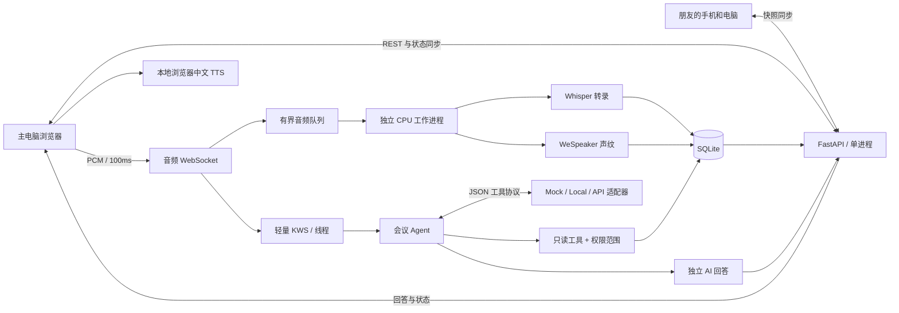

# 实现架构与取舍

## 单机，多客户端

主要边界：浏览器负责采集与播放，服务端负责权限与事实数据，独立进程负责较重的音频模型。桌面、手机共用 Web UI，避免一开始承担两套原生桌面音频接口。

## 同步与一致性

- 每场会议单调递增 `seq`，发言和引用使用稳定 ID；文本修改增加发言版本和会议 revision。
- SQLite 在同一事务中保存业务修改和事件顺序号。快照通过读事务保持 revision、文字和 seq 一致。
- WebSocket 推送完整快照。客户端按 seq 丢弃旧快照；断线重连重新取全量快照，定期同步作为补偿。当前不宣称实现事件增量重放。
- 同一录音会话只有一个主设备连接。录音分片及问答都有请求键；已处理的重复请求不会再次写入记录。
- 数据库是持久事实，内存只保存连接、运行状态和有界任务。服务重启将未完成上传任务标记失败，允许显式重试。

## Agent 与工作流

摘要是固定结构化工作流；小K问答是由模型选择只读工具的受限循环。二者分别实现，避免把全部功能包装成无边界 Agent。

工具不接受 meeting_id，自始至终绑定调用者当前会议的快照。最终引用必须由此次工具返回，保存引用版本；文字修正后原回答显示过时。该检查证明引用实体存在且已被读取，不能证明模型的自然语言结论一定受引用支持，所以还需要人工评审和真实模型评测。

模拟模式有固定工具决策和原文摘录。真正的模型可选择工具，但不能读文件、联网、执行代码、改变权限或执行待办。工具参数与输出经过 Schema 和预算限制；过程记录为工具名、参数、结果和耗时，不保存隐藏思维链。

## 声纹

先分窗口，再计算预训练嵌入，与本次会议已授权声纹比较。登记支持1～3段语音的归一化嵌入均值。阈值及第一/第二候选分差不足则拒识，结果发布前再次核对撤回状态。

声纹关联用户自己选择的昵称，不用于认证。原始登记录音不持久化，向量保存在本机数据库。暂不支持多个会议间复用档案、持续学习和可靠的重叠语音分离。

## 小K回答与事实边界

语音AI答案直接保存为 `answers`，不要把TTS音频重新转录成 `utterances`。纪要输入包含人类发言和明确标识为AI建议的共享语音问答；主持人采纳另存 `decisions` 并保留回答来源，AI建议不能自动成为决定。回答的依据变动后禁止直接再次采纳。文字私聊另存 `private_answers`，永不进入共享快照、纪要、导出或采纳接口。

半双工换取可实现、可测试的回声隔离：语音问题处理与播报期间不接纳新的会议音频；恢复时清空缓冲与唤醒流，等待短尾音保护。全双工和语音打断暂不实现。

## 现阶段的具体限制

- 完整快照会随会议增长变大，先验证30分钟、少量客户端；后续再增加分页与事件差量。
- 本机文件和SQLite没有实现应用层磁盘加密；仅用于本人和朋友的授权测试。
- 当前本地声纹阈值为开发初值，测试报告必须分别统计错误匹配、拒识和未知者误接纳。
- 浏览器关闭或录音主设备断网会中断采集。已收到分片可恢复，未收到的声音不能凭空补齐。
- 所有语音模型在同一独立工作进程复用，KWS另用轻量线程；队列达到上限则停止并报错。
- 操作系统麦克风、浏览器TTS和Windows兼容必须通过真机测试，CI和合成音频无法替代。

## 上游实现依据

- [FastAPI WebSocket](https://fastapi.tiangolo.com/advanced/websockets/)
- [浏览器麦克风的安全上下文要求](https://developer.mozilla.org/en-US/docs/Web/API/MediaDevices/getUserMedia)
- [faster-whisper：CPU 推理、PyAV 解码与词时间戳](https://github.com/SYSTRAN/faster-whisper)
- [sherpa-onnx 声纹提取示例](https://github.com/k2-fsa/sherpa-onnx/blob/master/python-api-examples/speaker-identification.py)
- [sherpa-onnx 关键词检测示例](https://github.com/k2-fsa/sherpa-onnx/blob/master/python-api-examples/keyword-spotter.py)

## 无设备的现场参会者

主持人可直接添加 `attendee` 角色，确认本人已同意会议记录。该身份没有发放给浏览器的登录令牌，使用已有成员表即可兼容历史数据库。普通参会者不能代管他人的声纹；主持人只可通过专用接口代管本场现场添加的成员，不能覆盖其他浏览器成员的自主登记。所有成员共用每场12人的名额。

为现场成员登记声纹时需单独确认本人授权，支持主电脑录音和上传1～3段音频，使用与自主登记相同的模型和短窗口匹配流程。名单和声纹状态经WebSocket同步。声纹向量保存在本机，原始登记音频不长期保留；会议录音仍按原流程保存。撤回后再次使用需重新取得同意并登记。

## 私聊权限与结束清理

`GET/POST /private-chat` 从认证令牌获取成员ID，不接受客户端指定归属。旧 `/ask` 仅作为私聊兼容入口，严格拒绝 `spoken` 参数；共享回答只能从服务端的语音处理链路生成。公共WebSocket始终发送同一份不含私聊的会议快照。私聊接口返回 `Cache-Control: no-store`，前端仅在当前身份的React内存中展示，并分别处理正在发送状态。

私聊Agent使用本人的最近历史理解追问，工具检索可引用人类发言、共享语音问答和纪要草稿，后两者显式标记来源。语音Agent仅构造共享上下文，不读取私聊表。总结流程不接受私聊历史，不使用私聊工具轨迹。

结束会议与清空所有成员的私聊在同一SQLite事务中完成，并取消尚未完成的私聊请求。保存私聊时再次检查会议状态，禁止迟到回答在结束后重新落库。私聊任务按成员互斥，独立于语音录音/推理状态；会议结束或删除不必等待私聊模型超时。旧文字回答迁移不复制到公开接口，并通过外键级联移除其旧采纳项。数据库重开测试验证清理与迁移可重复执行。
